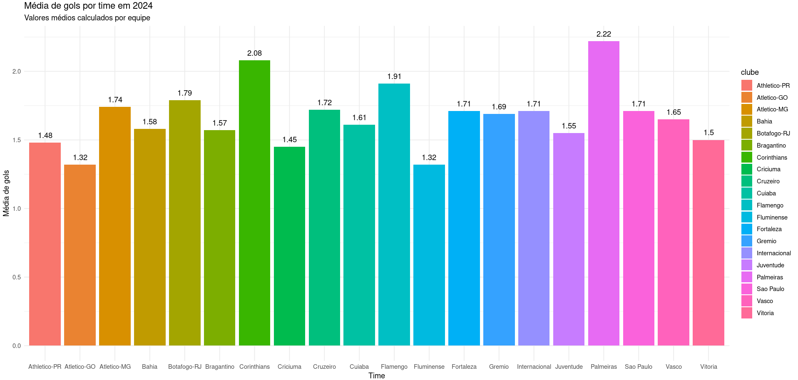
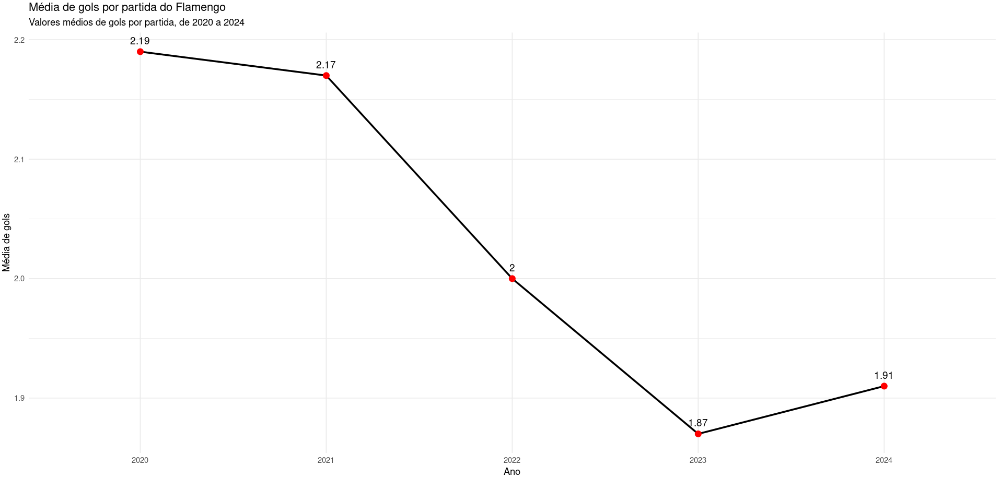

# 📊 DataFutBrasileiro

Neste projeto serão extraídos insights e elaborados gráficos.  

---

## 🖥 Sobre o projeto
Este projeto foi criado para extrair insights de dados sobre cartões, gols e estatísticas de partidas do campeonato brasileiro.  

---

## 📂 DataSet utilizado
- [Kaggle - Campeonato Brasileiro de Futebol](https://www.kaggle.com/datasets/adaoduque/campeonato-brasileiro-de-futebol/data)

---

## ✅ Gráficos prontos!
<p align="center">
  
</p>

<p align="center">
  
</p>

---

## 🛠 Ferramentas Utilizadas
<p align="center">
  
</p>

---

## 👷 Como rodar

1. **Clonar o repositório:**
   ```bash
   git clone https://github.com/pedroAlmeidaDev/DataFutBrasileiro.git
