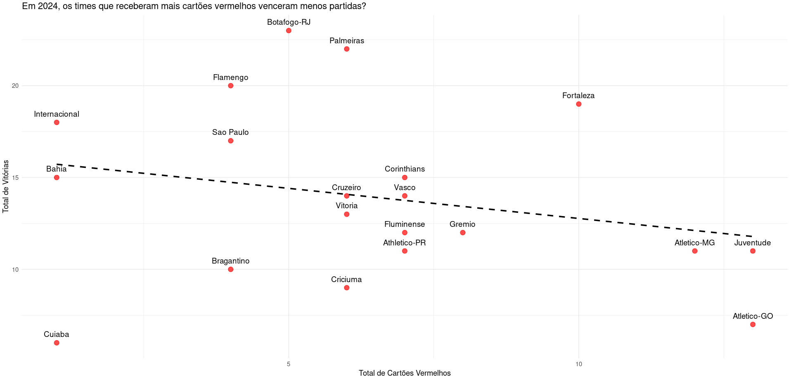

# 📊 DataFutBrasileiro

Neste projeto serão extraídos insights e elaborados gráficos.

------------------------------------------------------------------------

## 🖥 Sobre o projeto

Este projeto foi criado para extrair insights de dados sobre cartões, gols e estatísticas de partidas do campeonato brasileiro.

------------------------------------------------------------------------

## 📂 DataSet utilizado

-   [Kaggle - Campeonato Brasileiro de Futebol](https://www.kaggle.com/datasets/adaoduque/campeonato-brasileiro-de-futebol/data)

------------------------------------------------------------------------

## ✅ Gráficos prontos!

------------------------------------------------------------------------

## 🛠 Ferramentas Utilizadas

------------------------------------------------------------------------

## 👷 Como rodar

1.  Clonar o repositório.git clone <https://github.com/pedroAlmeidaDev/DataFutBrasileiro.git>

2.  Entrar no RStudio(Posit).Criar um (New Project).

3.  Dentro do novo projeto, abrir a pasta do arquivo em (OpenFile).
